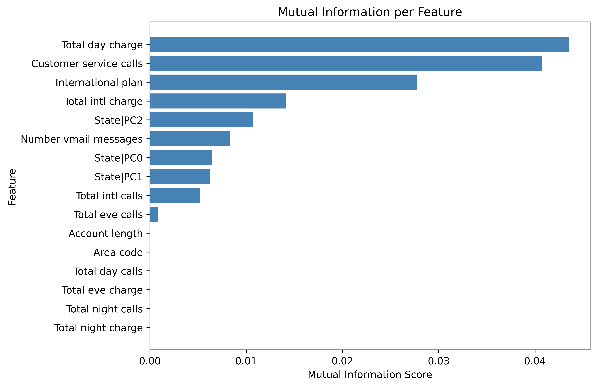
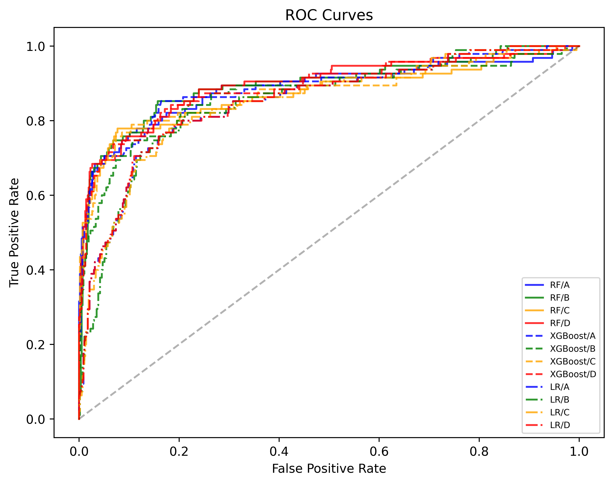

# CS5228-Project
A data mining and machine learning project focused on customer churn prediction, covering exploratory data analysis, feature engineering, supervised learning, and synthetic data generation.

# Overview
This project investigates the patterns associated with customer churn and evaluates different approaches for predicting whether a customer is likely to leave a service.

The project covers:
* Exploratory Data Analysis
* Feature engineering and selection
* Feature interaction analysis
* Supervised classification
* Class imbalance handling
* Model calibration and ensembles
* Model evaluation and threshold analysis
* Synthetic data generation using probabilistic models

# Methodology
## 1. Machine Learning
Three primary classifiers are evaluated:
* Random Forest
* XGBoost
* Logistic Regression

Experiments investigate different approaches to class imbalance:
* Baseline models
* Class weighting
* SMOTE oversampling
* Model calibration and ensembles

A reduced six-feature representation is also evaluated to investigate whether a smaller feature set can maintain or improve predictive performance.

The best-performing experiment achieves an **F1 score** of approximately **0.74** using Random Forest with the reduced feature set.

## 2. Synthetic Data
A Bayesian Network is used as the main probabilistic generative model. It models dependencies between customer attributes and the Churn target, which 
are then used to generate new synthetic customer records.

The generated data is compared against the real data to investigate:
* Distribution similarity
* Feature relationships
* Predictive utility
  
The pipeline also includes Gaussian Copula and bootstrap approaches as fallbacks.

# Installation
1. Create the Conda environment:
```
conda env create -f environment.yml
conda activate CS5228
```
2. Additional dependencies can be installed with:
```
pip install xgboost imbalanced-learn scipy pgmpy sdv
```

# Running the Project
```bash
# Exploratory Data Analysis
python Source/EDA.py

# Supervised Learning
python Source/Supervised.py

# Synthetic Data Generation
python Source/GenAI.py
```
Generated outputs are saved under the corresponding directories in **Results/**

# Results
<p> Feature selection and interaction analysis were used to identify the most informative variables for predicting customer churn. </p>
<p align="center">
   
</p> 

</p> Random Forest, XGBoost, and Logistic Regression were evaluated under different approaches to class imbalance and model calibration. </p>
<p align="center">
   
</p>

The strongest saved configuration is Random Forest with the reduced six-feature representation, achieving an F1 score of approximately 0.74 on the held-out evaluation data.
The project then explores synthetic customer-data generation using a Bayesian Network.


<p align="center">
   
  
</p>

The generated data is evaluated against the real dataset to investigate whether the synthetic records preserve both statistical characteristics and predictive utility.

# Summary
The project progresses from feature engineering and feature-space analysis into supervised churn prediction, followed by synthetic-data generation and evaluation.
The results demonstrate both the predictive capability of conventional machine-learning models and the potential of probabilistic generative approaches for producing useful synthetic customer data.


# License
This project is licensed under the GNU General Public License v3.0 (GPL-3.0).

See LICENSE for details.
